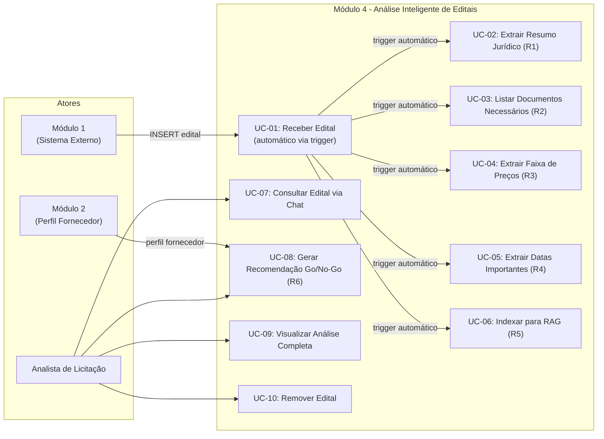
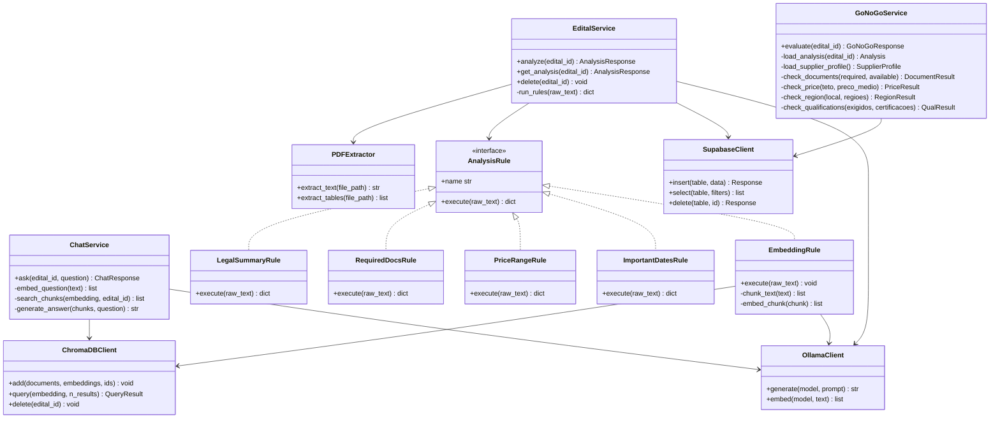
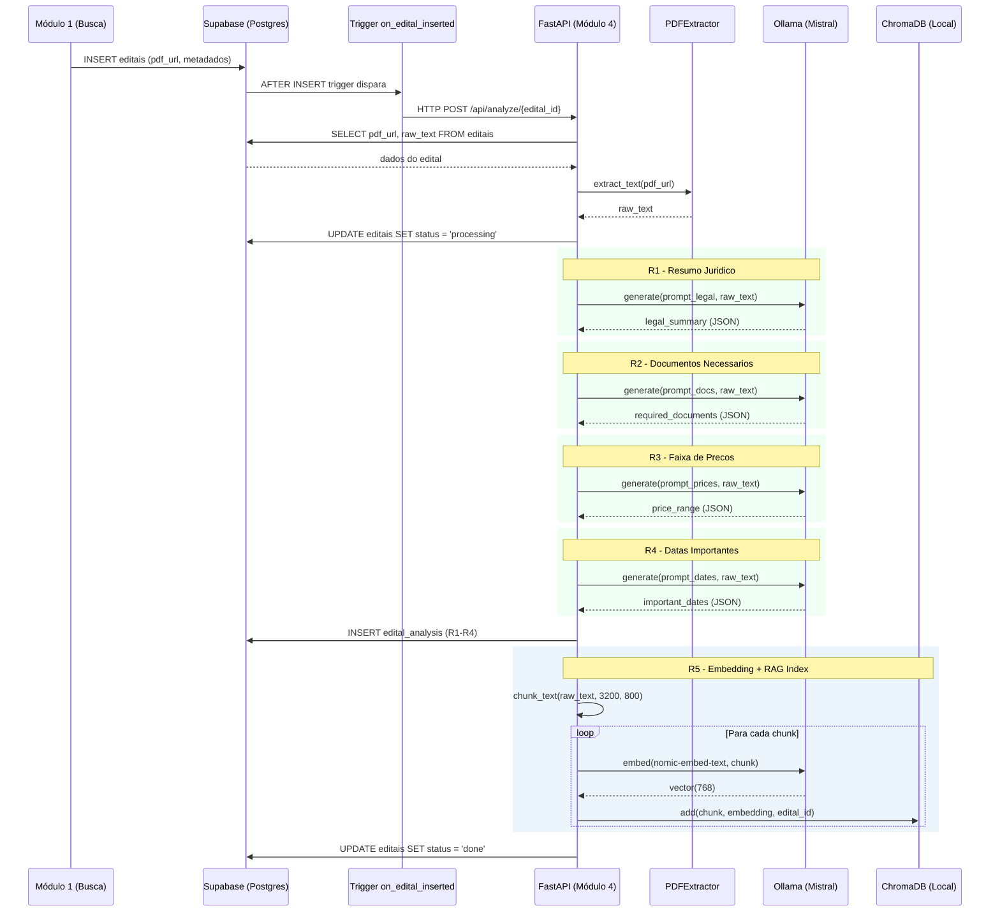
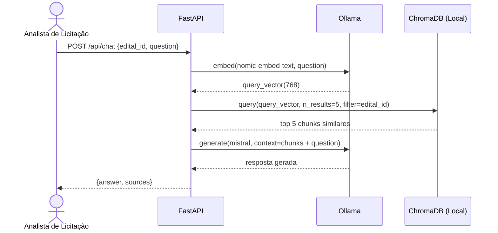
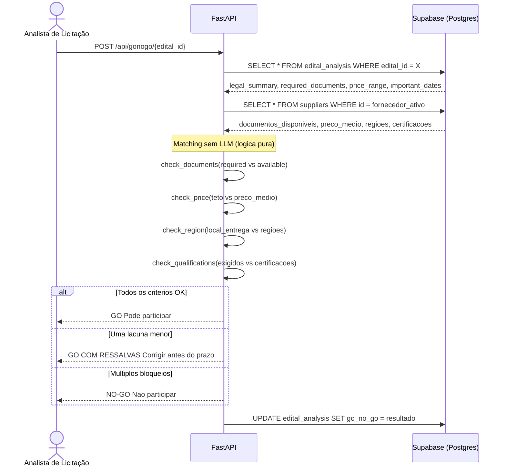
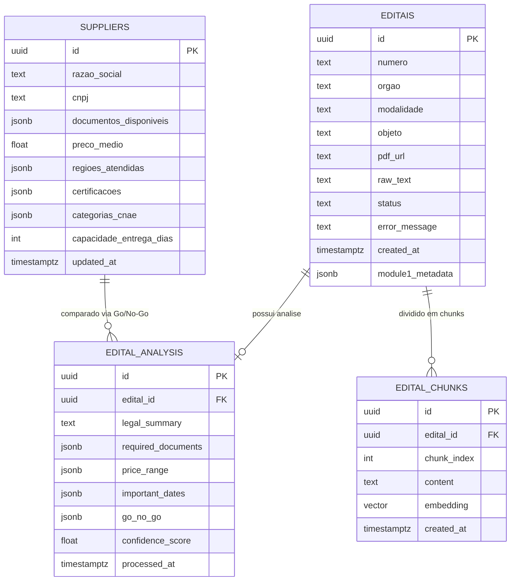
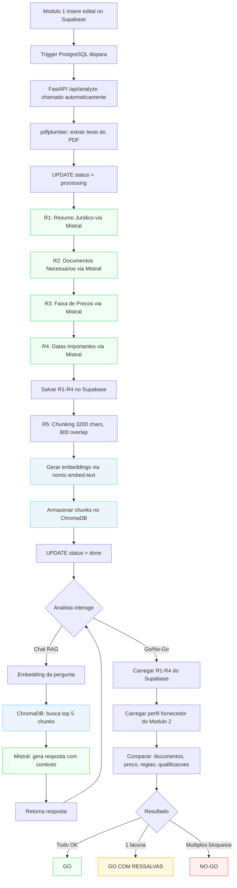
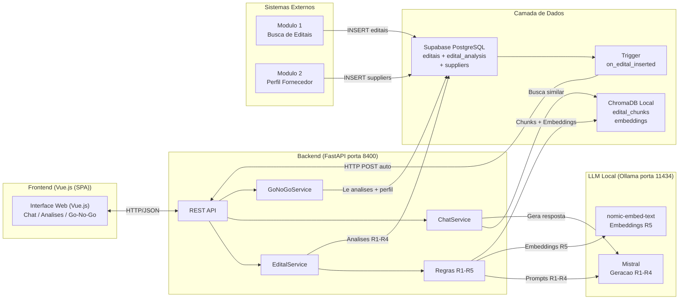
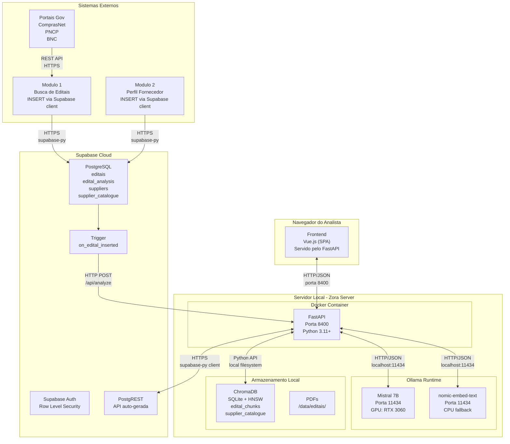
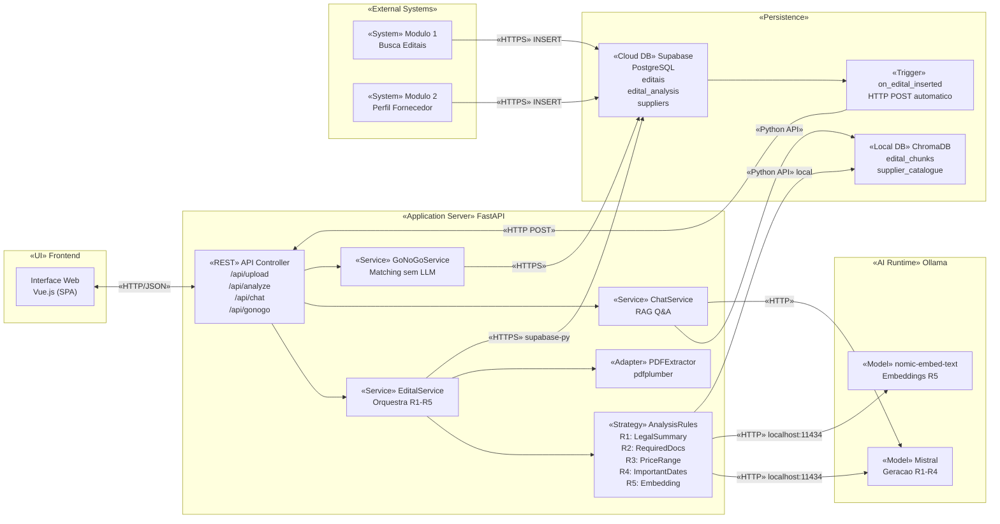

# Módulo 4 - Diagramas UML

> Engenharia de Software - Prof. Kurt - UNISC 2026/1  
> Entrega 3 - Documento de Arquitetura + Diagramas UML  
> Autor: Henrique Hayes Hesse

---

## 1. Diagrama de Casos de Uso

---

## 2. Diagrama de Classes

---

## 3. Diagrama de Sequência - Processamento Automático (Trigger)

---

## 4. Diagrama de Sequência - Chat RAG

---

## 5. Diagrama de Sequência - Go/No-Go (R6)

---

## 6. Diagrama ER (Entidade-Relacionamento)

---

## 7. Diagrama de Atividades - Pipeline Completo

---

## 8. Diagrama de Componentes

---

*Módulo 4 - Diagramas UML v2.0 - UNISC 2026/1 - Henrique Hayes Hesse*

---

## 9. Diagrama de Implantação

---

## 10. Diagrama de Componentes com Interfaces

